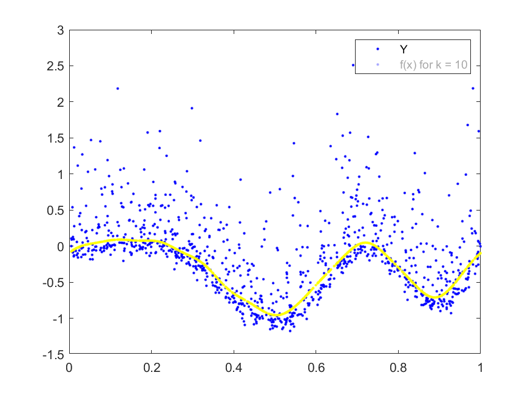
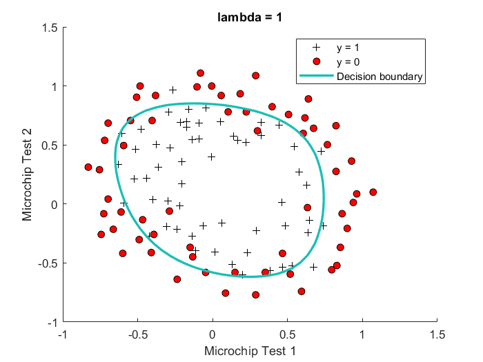
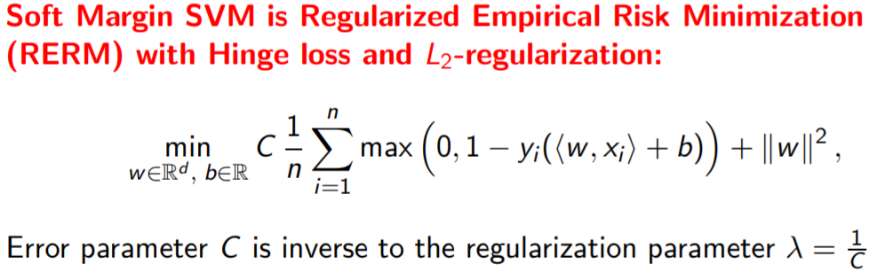
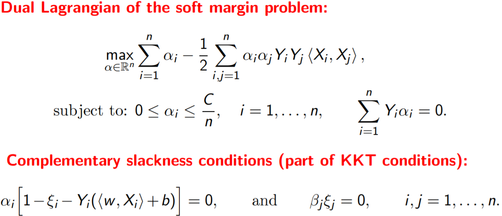
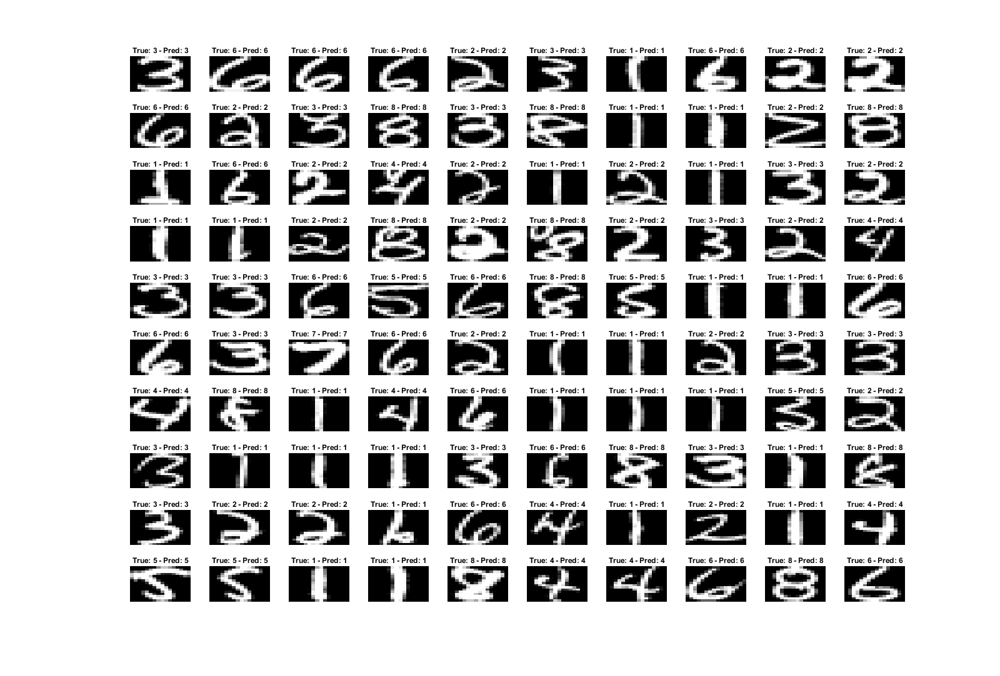
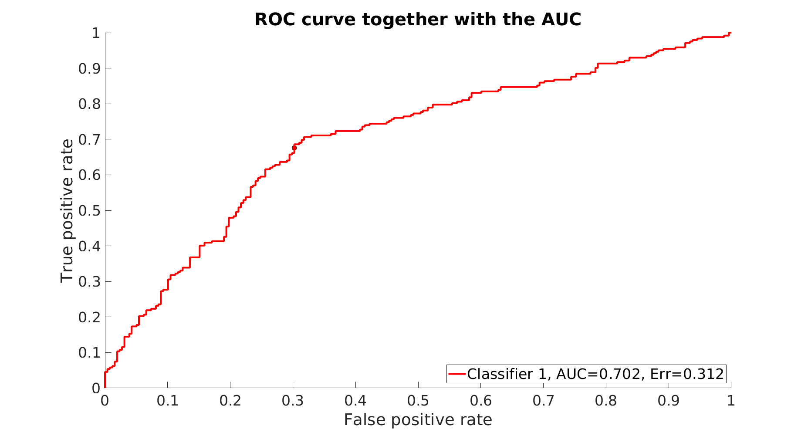
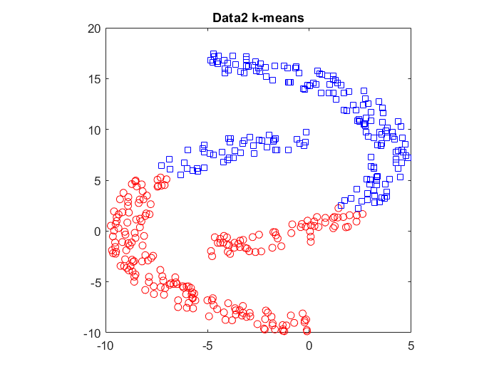
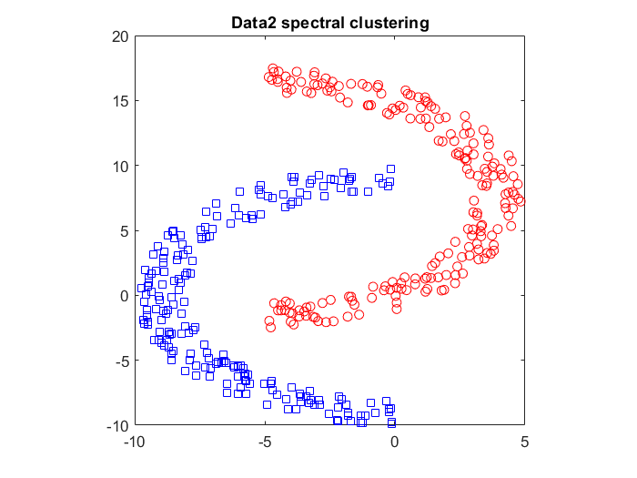
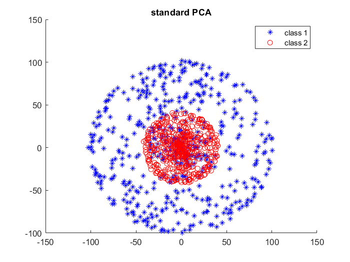
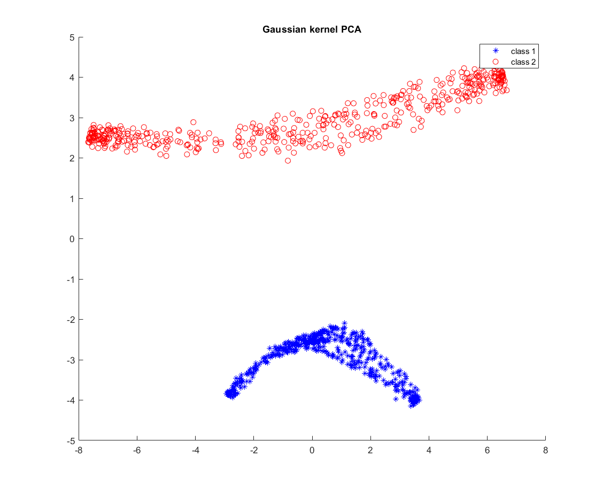

# Machine Learning Lib

Contains many functions useful in Machine Learning with tested scripts

1. ## Multi-variate regression

    ### Functions

      1. Ridge Regression: Least Squares + L_2 Regularization.
        * Closed Form solution using Normal Equation
      2. Lasso Regression
        * Implemented using Projected Gradient Descent
      3. Fourier Basis functions

    ### Applications

      1. In the first example we have only one feature, thus we want to learn it's function. We use Fourier Basis and L1 Loss with L2 regularization since the data looks skewed.
        
        2. The second example is a real dataset. The task is to predict the total number of violent crimes per 100K population from a set of (99) features. Polynomial basis was used capturing all sorts of properties of the cities and their population in non-linear fashion.

    ### Properties

      * Polynomial basis
      * Validation data sorted out
      * Data Normalization

2. ## Binary Classification
    
    ### Logistic Regression
    
    Logistic regression with L1 Regularization
    
    
    
    ### Dual Coordinate Ascent for Linear SVM

    Soft margin SVM is regularized empirical risk minimization with hinge loss and L2 regularization.

     
    Coordinate ascent method for solving the dual of the soft-margin SVM problem. For simplicity, we restrict to the case where the offset b is fixed at zero. The dual problem in this case is given by:

    

3. ## Multi-class schemes for classification of handwritten digits

    Handwritten digit classification using multi-class SVM with a Gaussian kernel. In order to solve the optimization problem for the SVM, we are using the MATLAB interface to the LIBSVM package (http://www.csie.ntu.edu.tw/~cjlin/libsvm/). Tested with libsvm 3.14

    One vs All and One vs One techniques are compared. Check the respective .m files of the same

    

4. ## Cross Validation in Feature Selection

    Exhaustive search for the best feature subset and permutation test.

5. ## ROC curve and AUC

	Inspecting the datasets and the predictions made by the two methods. Comparing with a random classifier and then permutation test to check if the methods are better than the random classifier or not.

	

	### Permutation tests

	permutation test for testing whether p(x|y = 1) is equal to p(x|y = −1) using the Fisher-score as the test-statistic (1000 permutations drawn uniform at random) and return the p-value.

6. ## Gentle Boost

	Implements Gentle Boost using a real-valued decision stump as the weak base classifier.

7. ## Clustering

	### K-means clustering

	Lloyd's algorithm for k-means clustering

	### Spectral clustering

	Spectral clustering using unnormalized graph Laplacian

	
	

8.  ## Kernel PCA

	PCA vs Kernel PCA with a gaussian kernel

	
	

## Authors
[Zeeshan Khan Suri](https://github.com/zshn25), 
[Jyotsna Singh](https://github.com/jyotsna792), 
[Harshita Jhavar](https://github.com/harshitaJhavar)

## Acknowledgements
This library started as successfully finished assignments from [Machine Learning](https://www.mpi-inf.mpg.de/departments/computer-vision-and-machine-learning/teaching/courses/ws-20182019-machine-learning/) course from Saarland University. It also includes finished assignments form te Machine Learning course from Andrew Ng.

## License
Licensing of the course assignments apply

