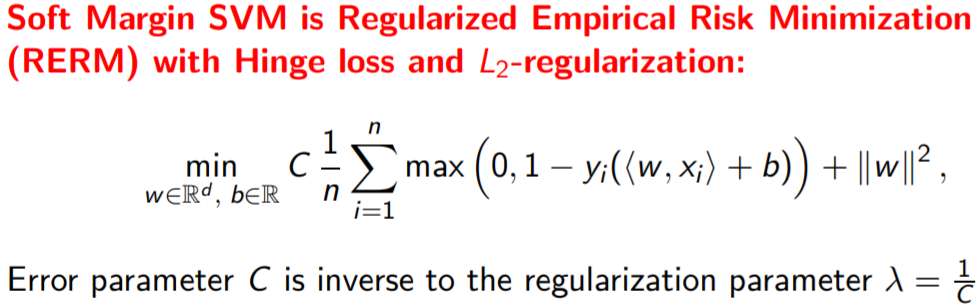
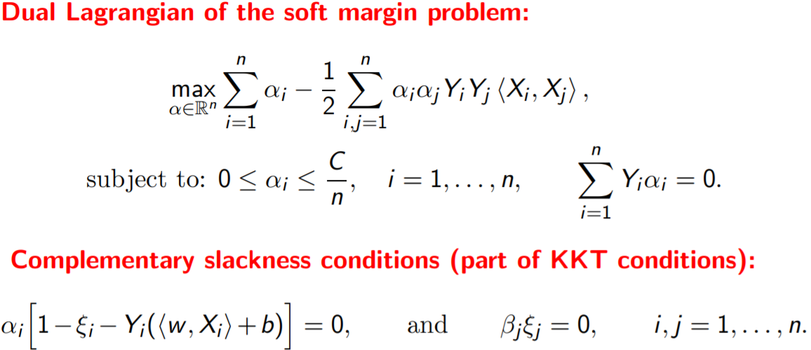
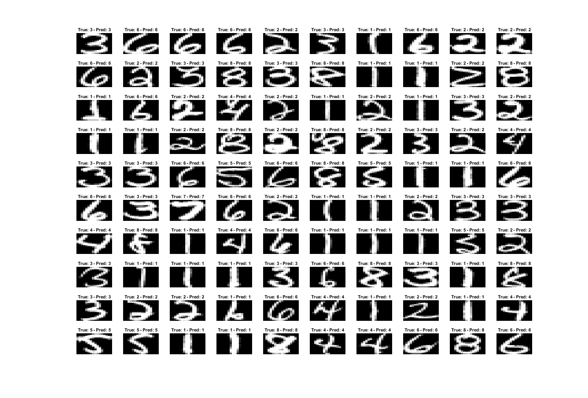

# Machine Learning Lib

Contains many functions usedful in Machine Learning with tested scripts

1. ### Multi-variate regression
	#### Functions:

	1. Ridge Regression: Least Squares + L_2 Regularization.
		* Closed Form solution using Normal Equation
	2. Lasso Regression
		* Implemented using Projected Gradient Descent
	3. Fourier Basis functions

	#### Applications:

	1. In the first example we have only one feature, thus we want to learn it's function. We use Fourier Basis and L1 Loss with L2 regularization since the data looks skewed.
	
	<!-- Format:   -->
	2. The second example is a real dataset. The task is to predict the total number of violent crimes per 100K population from a set of (99) features. Polynomial basis was used capturing all sorts of properties of the cities and their population in non-linear fashion.

	#### Properties
	
	* Polynomial basis
	* Validation data sorted out
	* Data Normalization

2. ### Dual Coordinate Ascent for Linear SVM
	Soft margin SVM is regularized empirical risk minimization with hinge loss and L2 regularization.
	
	 
	Coordinate ascent method for solving the dual of the soft-margin SVM problem. For simplicity, we restrict to the case where the offset b is fixed at zero. The dual problem in this case is given by:
	
	
	
3. ### Multiclass schemes for classification of handwritten digits
	Handwritten digit classification using multi-class SVM with a Gaussian kernel. In order to solve the optimization problem for the SVM, we are using the MATLAB interface to the LIBSVM package (http://www.csie.ntu.edu.tw/~cjlin/libsvm/).
	
