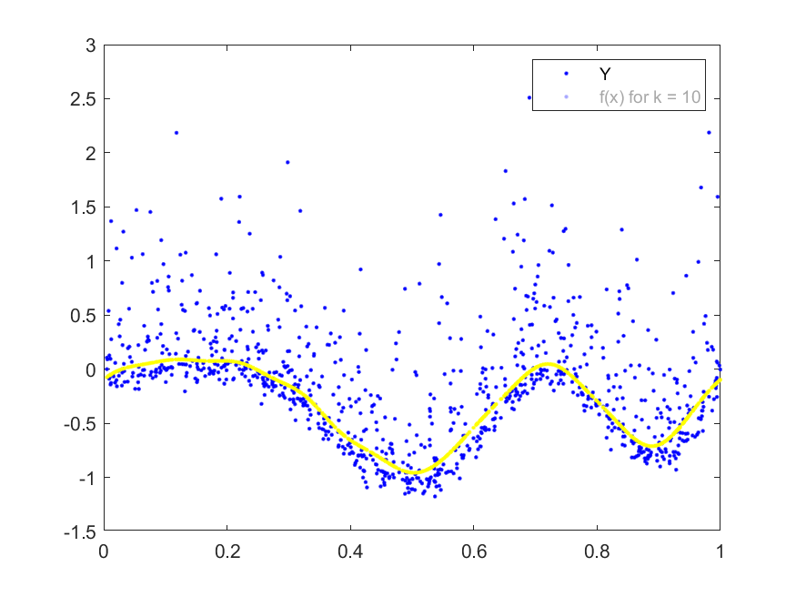

# Machine Learning Lib

Contains many functions usedful in Machine Learning with tested scripts

1. ### Multi-variate regression
	#### Functions:

	1. Ridge Regression: Least Squares + L_2 Regularization.
		* Closed Form solution using Normal Equation
	2. Lasso Regression
		* Implemented using Projected Gradient Descent
	3. Fourier Basis functions

	#### Applications:

	1. In the first example we have only one feature, thus we want to learn it's function. We use Fourier Basis and L1 Loss with L2 regularization since the data looks skewed.
	
	Format:  
	2. The second example is a real dataset. The task is to predict the total number of violent crimes per 100K population from a set of (99) features. Polynomial basis was used capturing all sorts of properties of the cities and their population in non-linear fashion.

	#### Properties
	
	* Polynomial basis
	* Validation data sorted out
	* Data Normalization
